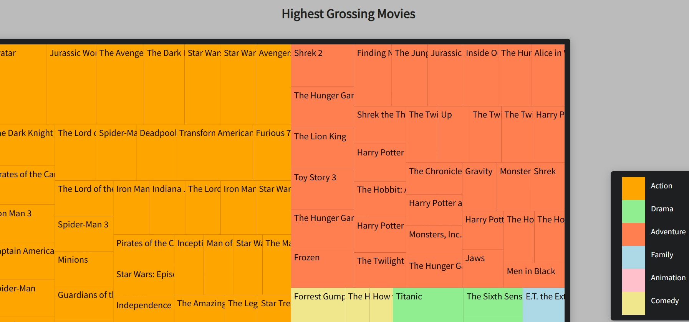

# Treemap-Diagram

[Live site](https://aneal07.github.io/Treemap-Diagram/)

This is FreeCodeCamp project visualizes different datasets in the form of treemaps. It's built using D3.js, a powerful library for creating data-driven visualizations.
